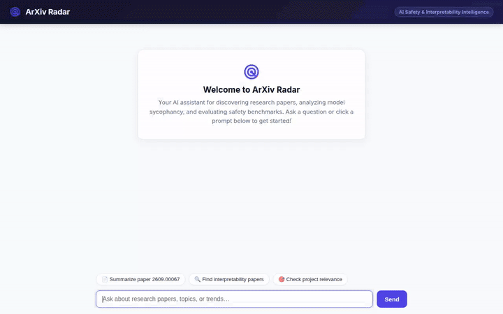

# ArXiv Radar 📡

**ArXiv Radar** is an autonomous AI agent designed to discover, synthesize, and analyze AI safety, model sycophancy, and interpretability research papers from arXiv. It equips researchers with paper summaries, cross-paper topic analysis, and rich visual A2UI cards for paper metadata.



---

## Key Features

- **arXiv Paper Discovery & Synthesis**: Searches arXiv by paper ID (e.g. `2609.00067`) or topic keywords and produces structured summaries with project relevance scoring.
- **A2UI Declarative Interface**: Automatically renders rich visual cards (v0.8 Basic Catalog) for paper metadata, authors, publication status, and key takeaways alongside text responses.
- **Interactive Chat UI**: Rebranded FastAPI A2A chat interface featuring a Slate Navy & Electric Indigo theme, user/agent avatars, welcome hero card, and clickable prompt suggestions.
- **Sandboxed Analytical Code Execution**: Executes data analysis scripts using `AgentEngineSandboxCodeExecutor`.

---

## Google Cloud Tools & Infrastructure

ArXiv Radar leverages Google Cloud Platform and Vertex AI services:

| Tool / Service | Purpose in ArXiv Radar |
|---|---|
| **Vertex AI Memory Bank** | Manages persistent long-term memory across user research sessions. |
| **Firestore (Cloud Datastore)** | Handles session state management and agent conversation persistence (`roles/datastore.user`). |
| **Google Cloud Storage (GCS)** | Hosts generated paper charts, figures, and media assets (`gs://arxiv-radar-media-qwiklabs-gcp-04-b94b6676e7e5`). |
| **Vertex AI RAG Engine** | Grounded retrieval and vector search across research paper corpora. |
| **Imagen 3 (Image Generation)** | Generates conceptual diagrams, workflow illustrations, and research benchmark badges. |
| **A2UI (Agent to UI)** | Emits declarative UI card payloads (`application/json+a2ui`) rendered natively in the frontend. |

---

## Architecture

```
                               ┌─────────────────────────────┐
                               │     Browser Chat UI         │
                               │  (HTML/JS + A2UI Renderer)  │
                               └──────────────┬──────────────┘
                                              │ HTTP POST /chat
                                              ▼
                               ┌─────────────────────────────┐
                               │   FastAPI Proxy (main.py)   │
                               │   (A2A Protocol / ADC Auth) │
                               └──────────────┬──────────────┘
                                              │ A2A Event Stream
                                              ▼
                               ┌─────────────────────────────┐
                               │  Deployed Agent Engine      │
                               │  (Agent Runtime / Vertex)   │
                               └──────────────┬──────────────┘
                                              │
         ┌──────────────────┬─────────────────┼──────────────────┬──────────────────┐
         ▼                  ▼                 ▼                  ▼                  ▼
  [Memory Bank]       [Firestore]       [GCS Bucket]       [RAG Engine]        [Imagen 3]
```

---

## 💻 Personal Laptop & Personal GCP Setup Guide

When running this repository on your personal laptop with your own personal Google Cloud account, follow these steps to connect and deploy your agent:

### 1. Prerequisites Installation
Install `uv` and `google-agents-cli` on your machine:
```bash
# Install uv package manager
curl -sSf https://astral.sh/uv/install.sh | sh

# Install agents-cli
uv tool install google-agents-cli

# Install Google Cloud SDK (gcloud)
# https://cloud.google.com/sdk/docs/install
```

### 2. Google Cloud Authentication & Project Setup
```bash
# 1. Log in with your personal Google account
gcloud auth login
gcloud auth application-default login

# 2. Set your personal GCP project ID
gcloud config set project YOUR_PERSONAL_PROJECT_ID

# 3. Enable Vertex AI & Firestore APIs
gcloud services enable aiplatform.googleapis.com \
                       datastore.googleapis.com \
                       storage.googleapis.com
```

### 3. Clone & Run Locally
```bash
# Clone your repository
git clone https://github.com/egfoes/buildwithgemini-arxiv-radar.git
cd buildwithgemini-arxiv-radar

# Install dependencies
uv sync

# Launch local CLI / Web playground
agents-cli playground
```

### 4. Deploying to Your Personal GCP Account
To host your agent on Vertex AI Agent Runtime in your personal GCP project:
```bash
agents-cli deploy
```
This command provisions a **Reasoning Engine** in `us-east1` and writes your personal agent resource name into `deployment_metadata.json`.

### 5. Running the Web Frontend with Your Personal Agent
```bash
# Export your new Reasoning Engine resource name
export AGENT_ENGINE_RESOURCE_NAME="projects/YOUR_PERSONAL_PROJECT_ID/locations/us-east1/reasoningEngines/YOUR_NEW_ENGINE_ID"
export AGENT_DIRECTORY="app"
export PORT="8080"

# Install frontend dependencies and start proxy
cd frontend
uv pip install -r requirements.txt
uv run python main.py
```
Open **`http://localhost:8080`** in your browser to interact with your live agent.

---

## Quickstart (Pre-configured Workspace)

### Prerequisites

- Python 3.11+
- `uv` package manager (`uv tool install google-agents-cli`)
- Application Default Credentials (ADC) configured:
  ```bash
  gcloud auth login
  gcloud auth application-default login
  ```

### Running the Local Web UI

1. Install frontend dependencies:
   ```bash
   cd frontend
   uv pip install -r requirements.txt
   ```

2. Set deployment environment variables:
   ```bash
   export AGENT_ENGINE_RESOURCE_NAME="projects/390086943548/locations/us-east1/reasoningEngines/3431373480149385216"
   export AGENT_DIRECTORY="app"
   export PORT="8080"
   ```

3. Launch the proxy server:
   ```bash
   uv run python main.py
   ```

4. Open **`http://localhost:8080`** in your browser.

---

## Project Structure

```
arxiv-radar/
├── app/                        # Agent application logic & tools
│   ├── agent.py               # ADK agent definition & callbacks
│   └── a2ui_utils.py          # A2UI Schema Manager & prompt injection
├── frontend/                   # Web frontend & proxy
│   ├── main.py                # FastAPI A2A proxy server
│   └── static/
│       └── index.html         # Rebranded Chat UI & A2UI mini-renderer
├── project_brief.md            # Detailed brief & future UI roadmap
├── demo.gif                    # Looping demo recording
└── README.md                   # Project documentation
```
